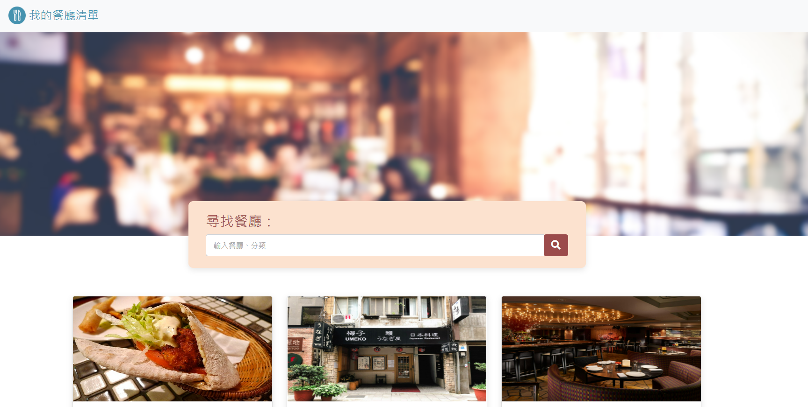
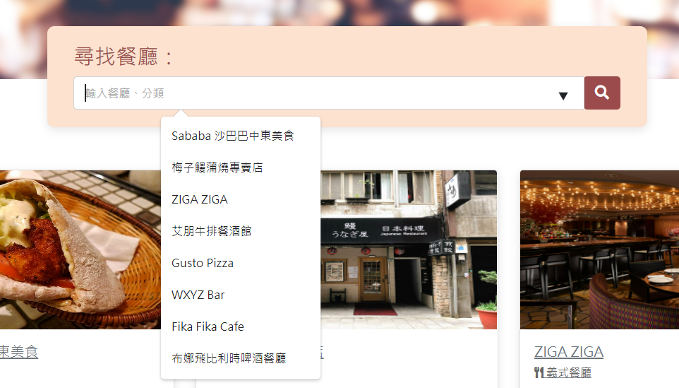

# 我的餐廳清單



## 介紹

紀錄屬於自己的餐廳清單，可以瀏覽餐廳、查看詳細資訊、甚至連結到地圖。

### 功能

使用者可以在首頁看到所有餐廳與它們的簡單資料：
* 餐廳照片
* 餐廳名稱
* 餐廳分類
* 餐廳評分

使用者可以再點進去看餐廳的詳細資訊：
* 類別
* 地址
* 電話
* 描述
* 圖片

使用者可以透過搜尋**餐廳名稱**或是**餐廳類別**來找到特定的餐廳
除了手動搜尋外，也在搜尋框中，可以使用下拉式選單選取餐廳


在餐廳詳細資訊中，使用者可以點擊**餐廳類別**，來查看所有相同類別的餐廳


## 開始使用

1. 請先確認有安裝 node.js 與 npm
2. 在終端機輸入以下指令，將專案 clone 到本地
   ```bash
   git clone https://github.com/freeway26tw/restaurant_list.git
   ```
   
3. 在本地開啟之後，透過終端機進入資料夾，輸入：

   ```bash
   npm install
   ```

   ps. 此時終端機上可能會出現「​​ high severity vulnerability 」的提示
   這是因為 3.0.0 並不是 express-handlebars 當前最新版本
   但此訊息不影響此專案的運作，因此可先忽略

4. 安裝完畢後，繼續輸入：

   ```bash
   npm run dev
   ```

5. 若看見此行訊息則代表順利運行

   ```bash
   Express is listening on http://localhost:3000
   ```

6. 打開瀏覽器進入到以下網址，即可連到網頁
   ```
   http://localhost:3000/
   ```


6. 若欲暫停使用，可回到終端機輸入

   ```bash
   ctrl + c
   ```

## 開發工具

- Node.js 14.16.0
- Express 4.16.4
- Express-Handlebars 3.0.0
- Bootstrap 5.1.3
- Font-awesome 5.8.1